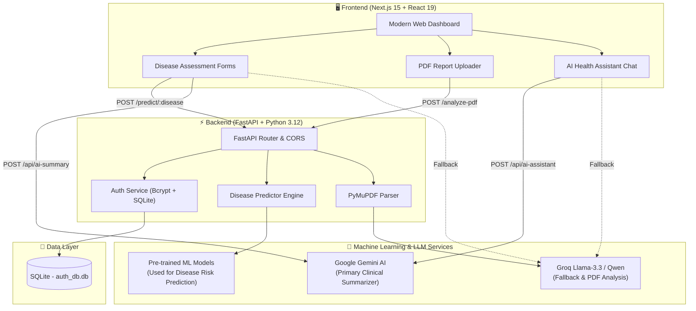

# 🏥 Medical Multi-Disease Risk Assessment System

An enterprise-grade, AI-powered healthcare intelligence platform that combines **Machine Learning models for disease risk prediction** across 8 major human diseases with **Generative AI clinical report analysis** and an **interactive medical assistant**.

---

[](https://www.python.org/)
[](https://fastapi.tiangolo.com/)
[](https://nextjs.org/)
[](https://react.dev/)
[](https://www.typescriptlang.org/)
[](https://tailwindcss.com/)
[](https://github.com/)
[](https://www.docker.com/)

---

## 📑 Table of Contents

- [✨ Key Features](#-key-features)
- [🔍 Supported Diseases for Risk Prediction](#-supported-diseases-for-risk-prediction)
- [🏛️ System Architecture](#️-system-architecture)
- [🛠️ Tech Stack](#️-tech-stack)
- [📦 Project Structure](#-project-structure)
- [🚀 Quick Start Guide](#-quick-start-guide)
  - [Prerequisites](#prerequisites)
  - [Option A: Local Development](#option-a-local-development)
  - [Option B: Docker Compose](#option-b-docker-compose)
- [🔑 Environment Variables](#-environment-variables)
- [📡 API Documentation](#-api-documentation)
- [🧪 Testing & Verification](#-testing--verification)
- [⚙️ Troubleshooting](#️-troubleshooting)
- [🤝 Contributing](#-contributing)
- [📄 License & Disclaimer](#-license--disclaimer)

---

## ✨ Key Features

| Feature | Description |
| :--- | :--- |
| 🩺 **8-Disease Risk Prediction** | Real-time predictive risk assessment across 8 major disease domains using specialized machine learning models. |
| 📄 **AI Medical Report & PDF Analyzer** | Upload clinical PDFs for automated extraction of diagnoses, abnormal markers, medications, and clinical recommendations (via PyMuPDF & Groq LLMs). |
| 🤖 **Interactive AI Health Assistant** | Built-in conversational AI chatbot providing evidence-based healthcare insights, triage guidance, and preventative tips. |
| 🧠 **Automated Clinical Summaries** | Dynamic natural-language health analysis explaining prediction reasoning, biomarker impacts, and risk factors (Gemini 2.5/3.7 with Groq fallback). |
| 🔐 **User Authentication & Profiles** | Secure registration, login, and session management with bcrypt password hashing and SQLite persistence. |
| ⚡ **Modern Responsive Interface** | Glassmorphic, dark-mode medical dashboard built with Next.js 15 App Router, Radix UI, Lucide icons, and Tailwind CSS. |
| 🐳 **Containerized Deployment** | Full Docker and Docker-Compose support for one-command environment orchestration. |

---

## 🔍 Supported Diseases for Risk Prediction

The system uses Machine Learning (ML) models to evaluate patient clinical parameters and predict risk for the following diseases:

| Disease | Key Biomarkers & Clinical Features Evaluated | Assessment Output |
| :--- | :--- | :--- |
| **Diabetes** | Glucose level, HbA1c, BMI, Age, Hypertension, Heart Disease, Smoking History | High / Low Risk + Confidence Score |
| **Stroke** | Avg Glucose, BMI, Age, Hypertension, Heart Disease, Work Type, Smoking Status | High / Low Risk + Confidence Score |
| **Parkinson's Disease** | UPDRS score, MoCA score, Motor symptoms (Tremor, Rigidity, Bradykinesia), Lifestyle | High / Low Risk + Confidence Score |
| **Thyroid Disease** | TSH, T3, T4, T4U, FTI levels, Clinical history (Surgery, I131, Thyroxine, Goitre) | High / Low Risk + Confidence Score |
| **Depression** | Academic/Work pressure, Sleep duration, Study satisfaction, CGPA, Financial stress | High / Low Risk + Confidence Score |
| **Hepatitis** | Liver panel (ALB, CHE, CHOL, log-AST, log-ALT, log-ALP, log-BIL, log-GGT, CREA) | High / Low Risk + Confidence Score |
| **Heart Disease** | Chest pain type, Resting BP, Cholesterol, Fasting BS, Resting ECG, Max HR, Oldpeak | High / Low Risk + Confidence Score |
| **Chronic Kidney Disease (CKD)** | Serum Creatinine, Blood Urea, Specific Gravity, Albumin, RBC/Pus cells, BP, Anaemia | High / Low Risk + Confidence Score |

---

## 🏛️ System Architecture



---

## 🛠️ Tech Stack

### **Frontend**
- **Framework**: [Next.js 15](https://nextjs.org/) (App Router, Server & Client Components)
- **Library**: [React 19](https://react.dev/) + [TypeScript 5](https://www.typescriptlang.org/)
- **Styling**: [Tailwind CSS 3.4](https://tailwindcss.com/) + `tailwind-merge` + `clsx`
- **UI Components**: [Radix UI](https://www.radix-ui.com/) Primitives, Lucide Icons, Sonner Toasts
- **Form Handling**: React Hook Form + Zod Validation

### **Backend**
- **Web Framework**: [FastAPI 0.135.1](https://fastapi.tiangolo.com/) + [Uvicorn 0.41.0](https://www.uvicorn.org/)
- **Runtime**: Python 3.12
- **ORM & Database**: [SQLAlchemy 2.0](https://www.sqlalchemy.org/) + SQLite (`auth_db.db`)
- **Document Processing**: [PyMuPDF (fitz) 1.27.2](https://pymupdf.readthedocs.io/)
- **Security**: Bcrypt password hashing & CORS Middleware

### **Prediction & AI**
- **Disease Risk Prediction**: Machine Learning (ML) Models
- **AI & LLM Integrations**: Google Gemini API (`gemini-2.5-flash`), Groq Cloud API (`llama-3.3-70b-versatile`, `qwen/qwen3.8-27b`)

---

## 📦 Project Structure

```
Medical-Disease-Risk-Assessment-System/
├── Backend/
│   ├── models/                    # Pre-trained ML model files for prediction
│   │   ├── diabetes/              # Diabetes ML model
│   │   ├── Stroke/                # Stroke ML model
│   │   ├── Parkinsons/            # Parkinson's ML model
│   │   ├── Thyroid/               # Thyroid ML model
│   │   ├── Depression/            # Depression ML model
│   │   ├── Hepatits/              # Hepatitis ML model
│   │   ├── Heart/                 # Heart disease ML model
│   │   └── Kidney/                # Chronic Kidney Disease ML model
│   ├── auth.py                    # Database dependency injection
│   ├── database.py                # SQLAlchemy engine & session setup
│   ├── main.py                    # FastAPI application entry & routes
│   ├── models.py                  # SQLAlchemy ORM models (User)
│   ├── predict_utils.py           # Model loading & deserialization helpers
│   ├── predictor.py               # Disease prediction handler
│   ├── schemas.py                 # Pydantic input schemas per disease
│   ├── utils.py                   # Password hashing & verification
│   ├── test_diseases.py           # Multi-disease endpoint test suite
│   ├── requirements.txt           # Python backend dependencies
│   ├── Dockerfile                 # Backend container definition
│   └── .env                       # Backend environment configuration
├── Frontend/
│   ├── app/                       # Next.js App Router
│   │   ├── ai-assistant/          # Interactive AI Doctor Assistant page
│   │   ├── FileUploadPage/        # PDF Medical Report Analyzer page
│   │   ├── diabetes/              # Diabetes assessment form
│   │   ├── stroke/                # Stroke assessment form
│   │   ├── parkinsons/            # Parkinson's assessment form
│   │   ├── thyroid/               # Thyroid assessment form
│   │   ├── depression/            # Depression assessment form
│   │   ├── hepatitis/             # Hepatitis assessment form
│   │   ├── heart/                 # Heart disease assessment form
│   │   ├── kidney/                # Kidney disease assessment form
│   │   ├── login/                 # Authentication: Login page
│   │   ├── signup/                # Authentication: Register page
│   │   ├── profile/               # User profile dashboard
│   │   ├── api/                   # Next.js Serverless API routes
│   │   │   ├── ai-assistant/      # Chatbot streaming/fallback handler
│   │   │   └── ai-summary/        # Clinical summary generation route
│   │   ├── layout.tsx             # Root layout & providers
│   │   └── page.tsx               # Homepage / Service selection dashboard
│   ├── components/                # Reusable UI components & Radix wrappers
│   ├── context/                   # AuthContext & state providers
│   ├── package.json               # Node.js dependencies & scripts
│   ├── Dockerfile                 # Frontend container definition
│   └── .env.local                 # Frontend environment configuration
├── architecture.jpg               # High-level architecture diagram
├── detailed_architecture.jpg      # Detailed component diagram
├── docker-compose.yml             # Multi-container orchestration
└── README.md                      # Project documentation
```

---

## 🚀 Quick Start Guide

### Prerequisites

Ensure you have the following installed on your system:
- **Python 3.12+** ([Download](https://www.python.org/downloads/))
- **Node.js 18+** & **npm** ([Download](https://nodejs.org/))
- **Git** ([Download](https://git-scm.com/))
- *(Optional)* **Docker & Docker Compose** ([Download](https://www.docker.com/))

---

### Option A: Local Development

#### 1. Clone the Repository

```bash
git clone https://github.com/rashedulalbab253/Medical-Multi-Disease-Risk-Assessment-System.git
cd Medical-Multi-Disease-Risk-Assessment-System
```

#### 2. Configure Environment Variables

Create `Backend/.env`:
```env
DATABASE_URL=sqlite:///./auth_db.db
SECRET_KEY=your_secure_random_jwt_secret_key
ACCESS_TOKEN_EXPIRE_MINUTES=60
GEMINI_API_KEY=your_gemini_api_key_here
GROQ_API_KEY=your_groq_api_key_here
```

Create `Frontend/.env.local`:
```env
NEXT_PUBLIC_API_URL=http://localhost:8000
GEMINI_API_KEY=your_gemini_api_key_here
GROQ_API_KEY=your_groq_api_key_here
```

> **API Key Resources**:
> - [Google AI Studio (Gemini Key)](https://aistudio.google.com/)
> - [Groq Cloud Console (Groq Key)](https://console.groq.com/)

#### 3. Backend Setup & Startup

```bash
cd Backend

# Create a virtual environment with Python 3.12
py -3.12 -m venv venv

# Activate virtual environment
# Windows (PowerShell):
.\venv\Scripts\Activate.ps1
# Windows (CMD):
.\venv\Scripts\activate.bat
# Linux / macOS:
source venv/bin/activate

# Install backend dependencies
pip install -r requirements.txt

# Start the FastAPI server
uvicorn main:app --host 0.0.0.0 --port 8000 --reload
```

> 🟢 **Backend**: [http://localhost:8000](http://localhost:8000)  
> 📖 **Interactive Swagger API Docs**: [http://localhost:8000/docs](http://localhost:8000/docs)

#### 4. Frontend Setup & Startup

Open a **new terminal**:

```bash
cd Frontend

# Install node dependencies
npm install --legacy-peer-deps

# Start the Next.js development server
npm run dev
```

> 🟢 **Frontend**: [http://localhost:3000](http://localhost:3000)

---

### Option B: Docker Compose

You can launch both the frontend and backend with a single command:

```bash
# Build and run containers in detached mode
docker-compose up --build -d
```

- **Frontend**: [http://localhost:3000](http://localhost:3000)
- **Backend API**: [http://localhost:8000](http://localhost:8000)
- **Swagger Docs**: [http://localhost:8000/docs](http://localhost:8000/docs)

To stop the containers:
```bash
docker-compose down
```

---

## 🔑 Environment Variables

### Backend Configuration (`Backend/.env`)

| Variable | Required | Description |
| :--- | :--- | :--- |
| `DATABASE_URL` | Yes | SQLite database URL (e.g., `sqlite:///./auth_db.db`) |
| `SECRET_KEY` | Yes | Secret key for hashing & session tokens |
| `ACCESS_TOKEN_EXPIRE_MINUTES` | No | Token expiration duration (default: `60`) |
| `GROQ_API_KEY` | Yes | Groq API key for PDF document analysis |
| `GEMINI_API_KEY` | Optional | Google Gemini API key |

### Frontend Configuration (`Frontend/.env.local`)

| Variable | Required | Description |
| :--- | :--- | :--- |
| `NEXT_PUBLIC_API_URL` | Yes | Backend base URL (e.g., `http://localhost:8000`) |
| `GEMINI_API_KEY` | Recommended | Gemini API key for assistant & summary generation |
| `GROQ_API_KEY` | Recommended | Groq API key fallback for assistant & summary |

---

## 📡 API Documentation

### Authentication Endpoints

| Method | Endpoint | Description | Request Body |
| :--- | :--- | :--- | :--- |
| `POST` | `/signup` | Register a new user | `{"username": "...", "email": "...", "password": "..."}` |
| `POST` | `/login` | Authenticate user | `{"email": "...", "password": "..."}` |

### Disease Prediction Endpoints

| Method | Endpoint | Description |
| :--- | :--- | :--- |
| `POST` | `/predict/diabetes` | Diabetes risk prediction |
| `POST` | `/predict/stroke` | Stroke risk prediction |
| `POST` | `/predict/parkinsons` | Parkinson's disease risk prediction |
| `POST` | `/predict/thyroid` | Thyroid disorder prediction |
| `POST` | `/predict/depression` | Depression risk prediction |
| `POST` | `/predict/hepatitis` | Hepatitis risk prediction |
| `POST` | `/predict/heart` | Heart disease risk prediction |
| `POST` | `/predict/kidney` | Chronic Kidney Disease prediction |

#### Sample Prediction Request & Response
```bash
POST /predict/diabetes
Content-Type: application/json

{
  "gender": 1,
  "age": 45.0,
  "hypertension": 0,
  "heart_disease": 0,
  "smoking_history": 0,
  "bmi": 25.0,
  "HbA1c_level": 5.5,
  "blood_glucose_level": 120
}
```

```json
{
  "prediction": 0,
  "probability": 0.082,
  "result": "Low Risk"
}
```

### Document & AI Analysis Endpoints

| Method | Endpoint | Description | Request Payload |
| :--- | :--- | :--- | :--- |
| `POST` | `/analyze-pdf` | Extract & analyze medical PDF report | `multipart/form-data` with `file: [PDF]` |
| `POST` | `/api/ai-assistant` | Next.js AI chatbot conversation handler | `{"message": "What is HbA1c?"}` |
| `POST` | `/api/ai-summary` | Next.js tailored clinical summary generator | `{"disease": "diabetes", "parameters": {...}, "prediction": 1, "probability": 0.85}` |

---

## 🧪 Testing & Verification

### Running Backend Automated Tests

To test all 8 disease prediction models simultaneously:

```bash
# Ensure the backend server is running on http://localhost:8000
cd Backend
python test_diseases.py
```

### Interactive API Verification

Open **[http://localhost:8000/docs](http://localhost:8000/docs)** to test all API endpoints with interactive Swagger UI schemas.

---

## ⚙️ Troubleshooting

| Issue | Cause | Solution |
| :--- | :--- | :--- |
| **`ModuleNotFoundError`** | Virtual environment not active or dependencies missing. | Activate venv (`.\venv\Scripts\Activate.ps1`) and run `pip install -r requirements.txt`. |
| **`Failed to fetch` on Frontend** | Backend server is not running or incorrect `NEXT_PUBLIC_API_URL`. | Ensure FastAPI is running on port 8000 and `Frontend/.env.local` contains `NEXT_PUBLIC_API_URL=http://localhost:8000`. |
| **`ERESOLVE` / npm install conflict** | Peer dependency strictness in npm. | Run `npm install --legacy-peer-deps`. |
| **`500 Internal Server Error` on PDF Analysis** | Missing `GROQ_API_KEY` in `Backend/.env`. | Add a valid Groq API key to `Backend/.env` and restart the backend server. |

---

## 🤝 Contributing

Contributions, issues, and feature requests are welcome!

1. **Fork the Repository**
2. **Create a Feature Branch** (`git checkout -b feature/AmazingFeature`)
3. **Commit your Changes** (`git commit -m 'Add some AmazingFeature'`)
4. **Push to the Branch** (`git push origin feature/AmazingFeature`)
5. **Open a Pull Request**

---

## 📄 License & Disclaimer

This project is licensed for educational and research purposes.

> ⚠️ **Medical Disclaimer**: This software is designed for educational, informational, and research purposes only. It is **not** intended to be a substitute for professional medical advice, diagnosis, or treatment. Always seek the advice of a qualified physician or healthcare provider with any questions regarding a medical condition.

---

<div align="center">
  <sub>Developed by <b>Rashedul Albab</b></sub>
</div>
